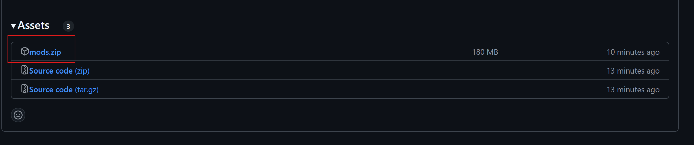

# Mods para Minecraft

> [!IMPORTANT]
> Se te descargará un archivo `.zip`. Extráelo y pon el contenido de cada carpeta en su lugar.
>
> **Recuerda que los paquetes de textura tienes que activarlos dentro del juego**.

## Tutorial

> [!WARNING]
> El tutorial está pendiente de ser grabado. Mientras tanto, puedes seguir los pasos escritos. **ETA: 15/09/2024**

## Links relevantes

- **[Vídeo](https://youtu.be/pIRSjKz9RLg?si=58i02kgNTFid2IGR&t=121)** para aumentar la RAM que utiliza el Minecraft.
- **[Descargar](https://fabricmc.net/use/installer/) Fabric**. **[Guía de instalación](https://fabricmc.net/wiki/install)**.
- **[Descargar](https://fabricmc.net/wiki/player:tutorials:java:windows) Java** para Minecraft.

## Releases

El archivo que necesitas descargar es el mostrado en la foto, solo con hacer clic comenzará la descarga.

- Versión **v1.1** para **Fabric 1.20.4**: **[Archivos]()**
- Versión **v1.0** para **Fabric 1.20.4**: **[Archivos](https://github.com/acoidaan/minecraft-mods/releases/tag/v1.0)**
