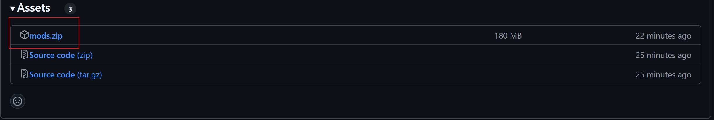

# Mods para Minecraft

> [!IMPORTANT]
> Se te descargará un archivo `.zip`. Extráelo y pon el contenido de cada carpeta en su lugar.
>
> **Recuerda que los paquetes de textura tienes que activarlos dentro del juego**.

## Tutorial

> [!WARNING]
> El tutorial está pendiente de ser grabado. Mientras tanto, puedes seguir los pasos escritos. **ETA: 15/09/2024**

## Links relevantes

- **[Vídeo](https://youtu.be/pIRSjKz9RLg?si=58i02kgNTFid2IGR&t=121)** para aumentar la RAM que utiliza el Minecraft.
- **[Descargar](https://fabricmc.net/use/installer/) Fabric**. **[Guía de instalación](https://fabricmc.net/wiki/install)**.
- **[Descargar](https://fabricmc.net/wiki/player:tutorials:java:windows) Java** para Minecraft.

## Releases

El archivo que necesitas descargar es el mostrado en la foto, solo con hacer clic comenzará la descarga.

- Versión **v1.1** para **Fabric 1.20.4**: **[Archivos](https://github.com/acoidaan/minecraft-mods/releases/tag/v1.1)**
- Versión **v1.0** para **Fabric 1.20.4**: **[Archivos](https://github.com/acoidaan/minecraft-mods/releases/tag/v1.0)**

## Mods

> [!NOTE]
> **Si algún mod no aparece, es porque se trata de un mod meramente optimizador** y no necesita ser descrito.

- ***Better Beacon Placement***: Este mod permite una colocación más flexible y eficiente de los beacons, mejorando la forma en que puedes construirlas.
- ***Biomes O' Plenty***: Añade una gran cantidad de biomas nuevos al mundo de Minecraft, con nuevos tipos de árboles, plantas y ambientes únicos.
- ***Comforts***: Introduce objetos como sacos de dormir y hamacas, que te permiten pasar la noche sin cambiar tu punto de reaparición.
- ***Distant Horizons***: Mejora la distancia de renderizado del mundo, permitiendo que puedas ver más lejos sin afectar demasiado el rendimiento.
- ***Dungeons and Taverns***: Añade mazmorras y tabernas generadas por el mundo, proporcionando nuevas oportunidades de aventura y exploración.
- ***Easy Anvils***: Facilita el uso de los yunques al reducir el costo de nivel de experiencia y mejorar su durabilidad.
- ***Easy Magic***: Introduce una forma más sencilla y accesible de encantamientos, mejorando el proceso de encantamiento y simplificándolo.
- ***Enhanced Block Entities***: Mejora la visualización y rendimiento de las entidades de bloques, como cofres y hornos, para un Minecraft más fluido.
- ***Essential***: Permite la funcionalidad de multijugador en mundos individuales, haciendo más fácil jugar con amigos sin servidores dedicados.
- ***Euphonium***: Agrega una serie de instrumentos musicales y sonidos para crear música en Minecraft, perfecto para los jugadores creativos.
- ***Harvest With Ease***: Permite una recolección más sencilla de cultivos sin necesidad de destruir las plantas, optimizando la cosecha.
- ***Healing Campfire***: Añade la capacidad de que las fogatas curen a los jugadores cercanos, añadiendo un aspecto de supervivencia útil.
- ***Mouse Tweaks (Fabric)***: Mejora el uso del inventario permitiendo arrastrar y soltar múltiples objetos con facilidad, ahorrando tiempo en la organización.
- ***Not Enough Animations***: Añade más animaciones a la experiencia de juego, haciendo que las acciones como comer o correr sean más dinámicas.
- ***More Mob Variants***: Introduce nuevas variantes visuales y comportamientos para los mobs, haciendo el juego más variado e impredecible.
- ***Nyf's Spiders***: Mejora el comportamiento y apariencia de las arañas en el juego, haciéndolas más desafiantes y realistas.
- ***OrthoCamera***: Ofrece una cámara ortográfica en Minecraft, permitiendo ver el mundo desde una perspectiva única.
- ***Refurbished Furniture (MrCrayfish)***: Expande las opciones de decoración con nuevos muebles y decoraciones, perfectos para crear casas más detalladas.
- ***Regions Unexplored***: Añade nuevas regiones y territorios por descubrir, aumentando la diversidad de biomas y terrenos en Minecraft.
- ***Roughly Enough Items (REI)***: Es una herramienta que permite ver todas las recetas de objetos en el juego y facilita la búsqueda de materiales necesarios.
- ***Sawmill***: Introduce la sierra, una herramienta que permite procesar madera de manera más eficiente para obtener más recursos.
- ***Small Ships***: Añade pequeños barcos personalizables que facilitan la navegación por agua y hacen más interesante el transporte marítimo.
- ***TerraBlender***: Herramienta para la generación de biomas personalizada, compatible con otros mods de biomas para mejorar la compatibilidad y el rendimiento.
- ***Trading Post***: Introduce un puesto de intercambio donde los jugadores pueden comerciar fácilmente con aldeanos sin necesidad de buscar sus puestos.
- ***Watut***: Mejora el comportamiento de los aldeanos y su interacción con el jugador, haciéndolos más útiles y dinámicos en sus rutinas diarias.
- ***Xaero's World Map***: Proporciona un mapa del mundo detallado y personalizable que se actualiza automáticamente mientras exploras nuevas áreas.
- ***YUNG's Better Mineshafts***: Rediseña las minas generadas en el mundo para hacerlas más extensas, detalladas y desafiantes.
- ***JJThunder To The Max***: Amplía los efectos climáticos en Minecraft, agregando tormentas más realistas y peligrosas.
- ***Jump Over Fences***: Permite a los jugadores saltar sobre las vallas.
- ***Do a Barrell Roll***: Cambia la manera de volar usando las elitras.
